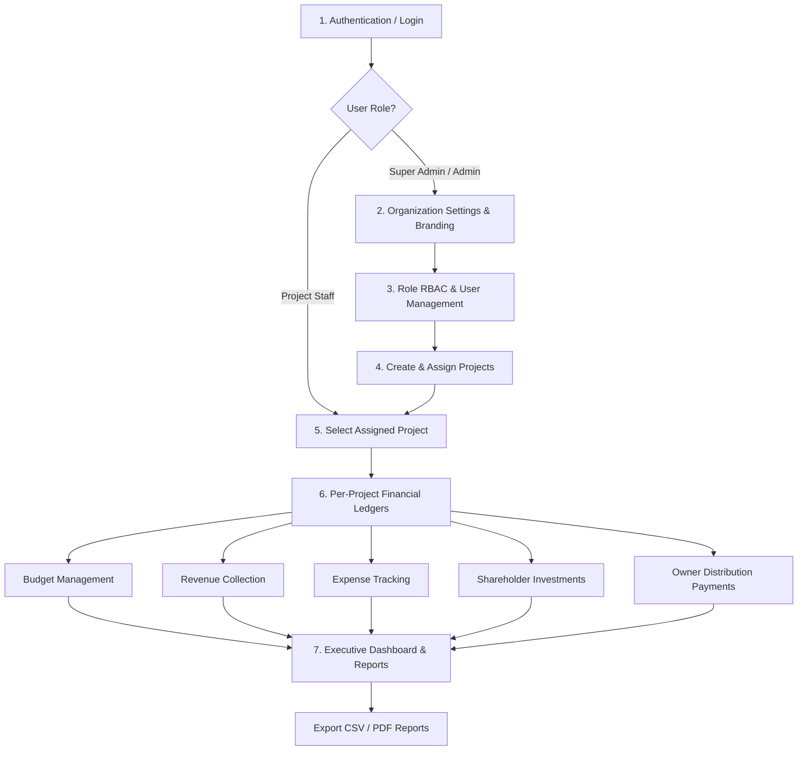

# Project Finance Admin — User & Workflow Guide

Welcome to the **Project Finance Admin** application manual. This document provides step-by-step instructions on **how to log in**, **demo credentials**, **security controls**, **financial calculation formulas**, and the **complete application usage workflow**.

---

## Part 1: Authentication & How to Login

### 1. Launching the Application
1. **Start the Backend API Server**:
   ```bash
   php artisan serve --port=9000
   ```
2. **Start the Frontend Vite Dev Server** (if developing):
   ```bash
   cmd /c npm run dev
   ```
3. Open your browser and navigate to: `http://localhost:9000` (or `http://localhost:5173`).

---

### 2. Default Demo Login Credentials
If the database has been seeded via `php artisan db:seed`, use any of the pre-configured accounts below:

| Role | Email | Password | Scope & Primary Use Case |
| :--- | :--- | :--- | :--- |
| **Super Admin** | `superadmin@example.com` | `password123` | Full system access, RBAC, global branding, centralized dashboards. |
| **Admin** | `admin@example.com` | `password123` | Complete administrative access across all projects and user accounts. |
| **Project Manager** | `pm@example.com` | `password123` | Manages assigned projects, budgets, revenue, and expenses. |
| **Accountant** | `accountant@example.com` | `password123` | Financial data entry and transaction ledger management. |
| **Viewer** | `viewer@example.com` | `password123` | Read-only access to assigned project reports and financial trends. |

---

### 3. Step-by-Step Login Process
1. Access the `/login` route.
2. Enter the **Email Address** and **Password** for your designated role.
3. Click **Sign In**.
4. **Post-Login Routing**:
   - **Super Admin & Admin**: Automatically routed to the **Centralized Dashboard** (`/dashboard`).
   - **Staff with 1 assigned project**: Automatically routed directly to that **Project Dashboard** (`/projects/:id`).
   - **Staff with multiple/no assigned projects**: Routed to **My Projects** (`/projects`).

---

### 4. Database Re-Seeding (Resetting Credentials)
To reset user accounts and populate demo financial records across 12 months, run:
```bash
php artisan migrate:fresh --seed
```

---

## Part 2: Financial Architecture & Calculation Formulas

All project financial metrics follow a standardized double-entry calculation system:

```
+-----------------------------------------------------------------------------------+
| CAPITAL INFLOW (Total Money) = Budget + Revenue + Shareholder Investment           |
| CAPITAL OUTFLOW (Deduct Money) = Expenses + Owner Payments                        |
+-----------------------------------------------------------------------------------+
| REMAINING BALANCE              = Total Money − Deduct Money                        |
| NET OPERATING PROFIT           = Revenue − Expenses                               |
+-----------------------------------------------------------------------------------+
```

### Formula Definitions
- **Total Money**: Sum of all allocated budget entries, collected revenue, and shareholder investments. Represents maximum capital available to the project.
- **Deduct Money**: Sum of all operational expenses and distributions paid out to project owners. Represents total capital disbursed.
- **Remaining Balance**: Total Money minus Deduct Money. Represents current available liquid funds for ongoing operations.
- **Net Profit**: Revenue minus Expenses. Evaluates pure operational financial gain or loss.

---

## Part 3: Complete Application Usage Workflow

### Workflow Overview Map


---

### Phase 1: Organization Branding & Global Settings
*Target Audience: Super Admin, Admin*

1. Navigate to **Settings** (`/settings/general`).
2. **Branding Setup**:
   - **Company Logo**: Click *Upload Logo* (PNG/JPEG/SVG/WebP). Appears in sidebar navigation.
   - **Favicon**: Click *Upload Favicon*. Updates browser tab icon dynamically.
3. **General Parameters**:
   - Fill in **Company Name**, **Address**, **Contact Email**, and **Phone**.
   - Set **Currency Symbol** (e.g. `$`, `€`, `£`, `Rs`, `Tk`). Real-time format preview updates instantly (`$12,500.50`).
4. Click **Save Global Settings**.

---

### Phase 2: User Provisioning & Access Control (RBAC)
*Target Audience: Super Admin, Admin*

1. **Managing Roles & Permissions** (`/settings/roles`):
   - Review pre-configured roles (*Super Admin*, *Admin*, *Project Manager*, *Accountant*, *Viewer*).
   - To create a custom role, click **Add New Role**.
   - Select granular permissions grouped by domain (*Budget*, *Revenue*, *Expenses*, *Shareholders*, *Owner Payments*, *System*).
   - Use **Select All** or **Clear All** helpers for fast configuration.
2. **Managing User Accounts** (`/users`):
   - Click **New User**.
   - Enter **Full Name**, valid **Email Address**, **Password**, and assign one or more **Roles**.
   - Use the **Live Search Bar** to quickly filter users by name, email, or role.
   - *Note*: You cannot delete your own logged-in account.

---

### Phase 3: Project Creation & Staff Assignment
*Target Audience: Super Admin, Admin*

1. Navigate to **Projects** (`/projects`).
2. Click **New Project**.
3. Fill in **Project Name**, **Description**, **Status** (*Active*, *On Hold*, *Completed*, *Archived*), and **Start/End Dates**.
4. Click **Create**.
5. **Assigning Team Members**:
   - On the projects table, click the **Assign Team Members** icon (`TeamOutlined`).
   - Select staff members from the multi-select dropdown.
   - Click **Save Assignments**.

---

### Phase 4: Financial Ledger Operations (Data Entry)
*Target Audience: Admin, Project Manager, Accountant*

Navigate to the target project dashboard (`/projects/:id`) or select from sidebar:

1. **Budget Ledger** (`/projects/:id/budget`):
   - Click **Add Entry**. Select **Date**, enter **Amount**, and **Description** (e.g., "Q1 Infrastructure Allocation").
2. **Revenue Ledger** (`/projects/:id/revenue`):
   - Click **Add Entry**. Enter **Date**, **Source**, **Amount**, and **Description**.
3. **Expense Ledger** (`/projects/:id/expenses`):
   - Click **Add Entry**. Enter **Date**, **Category** (e.g. Materials, Payroll, Equipment), **Amount**, and **Notes**.
4. **Shareholder Investment Ledger** (`/projects/:id/shareholders`):
   - Click **Add Entry**. Enter **Shareholder Name**, **Date**, **Investment Amount**, and **Notes**.
5. **Owner Distribution Payments** (`/projects/:id/owner-payments`):
   - Click **Add Entry**. Enter **Payment Method**, **Date**, **Amount**, and **Notes**.

---

### Phase 5: Executive Analytics & Financial Reporting
*Target Audience: All Roles (Filtered by Permissions)*

1. **Centralized Dashboard** (`/dashboard`):
   - View top hero welcome card with live time-of-day greeting.
   - Review 4 KPI cards: Total Money, Deduct Money, Remaining Balance, and Operating Profit.
   - Analyze 12-Month Org-Wide Financial Trend chart (ComposedChart with area gradients).
   - Review Projects by Status donut chart.
   - Examine **Top Projects by Remaining** and **Top Projects by Profit** leaderboards.
2. **Financial Reports** (`/reports`):
   - **Preset Period Selection**: Click preset buttons (*All Time*, *This Month*, *Last 3 Months*, *This Year*) or select custom date ranges.
   - **Exporting Reports**:
     - Click **Export CSV** to download standard spreadsheet report files (`project_report_1.csv` or `org_report_overview.csv`).
     - Click **Print / PDF** to generate formatted print statements.
   - **Consolidated Per-Project Table**: Filter multi-project summaries using live search and column sorters.

---

## Summary Checklist for New Deployments
- [x] Run database migrations and seeders (`php artisan migrate:fresh --seed`).
- [x] Configure company logo, favicon, and currency symbol under `/settings/general`.
- [x] Create project manager & accountant user accounts under `/users`.
- [x] Create active projects and assign staff under `/projects`.
- [x] Populate initial budget allocations and revenue/expense ledger entries.
- [x] Export financial summaries via `/reports`.
